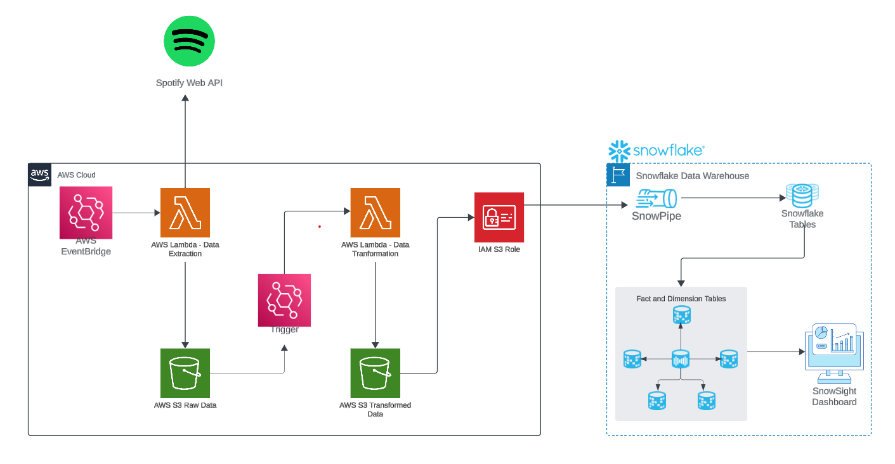
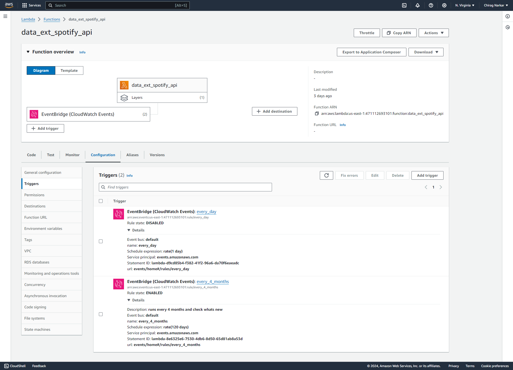
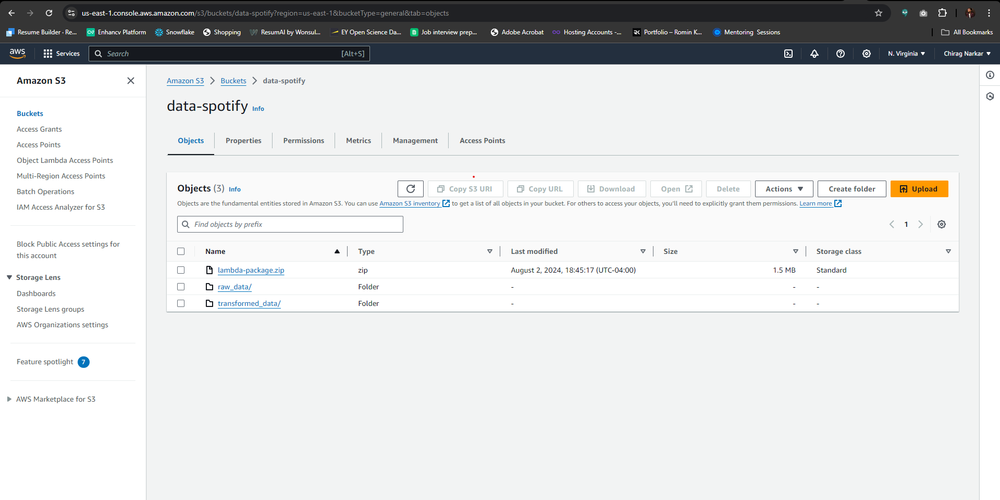
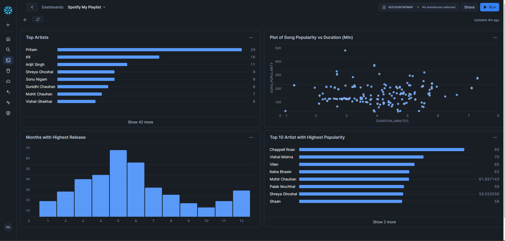

# Building a Data Pipeline for Spotify Playlist Analysis Using AWS and Snowflake

This project demonstrates the creation of a data pipeline to extract, transform, and analyze data from my personal Spotify playlist using AWS and Snowflake. The pipeline automates data extraction, transformation, and visualization processes.

## Architecture Overview

The architecture of this project involves a seamless integration of AWS services and Snowflake to automate data extraction, transformation, and visualization. An AWS Lambda function periodically extracts song data from the Spotify API and stores it in an S3 bucket. A second Lambda function, triggered by AWS EventBridge CloudWatch Events, transforms this raw data into structured CSV files. SnowPipes then automate the migration of this cleaned data from S3 to Snowflake tables. Finally, a Snowflake view consolidates the data, and an automatically updated Snowflake dashboard provides insights into my Spotify playlist.

## Project Architecture



## Components

### 1. AWS Lambda Function: Data Extraction

- Extracts song data from my personal Spotify playlist using the Spotify API.
- Configured to run every 120 days.
- Stores extracted raw data in an S3 bucket.


### 2. AWS Lambda Function: Data Transformation

- Triggered by changes in the S3 bucket.
- Transforms raw data into four CSV files:
  - Artists of each song.
  - Song data in my personal playlist.
  - Albums each song belongs to.


### 3. AWS EventBridge Rule

- Automatically triggers the data extraction Lambda function upon detecting changes in the S3 bucket.



### 4. S3 Bucket Structure

- Stores raw and transformed data.



### 5. AWS S3 Role for SnowPipe

- Configured to allow Snowflake to access the data in the S3 bucket.


## Snowflake Data Warehouse

### Table Schema

#### Albums Table (TB_ALBUM)
```sql
CREATE OR REPLACE TABLE TB_ALBUM(
    ALBUM_ID VARCHAR PRIMARY KEY,
    ALBUM_NAME VARCHAR,
    ALBUM_RELEASE_DATE DATE,
    ALBUM_TOTAL_TRACKS INT,
    ALBUM_URL VARCHAR
);
```

#### Albums Table (TB_ARTIST)
```sql
CREATE OR REPLACE TABLE TB_ARTIST(
    ARTIST_ID VARCHAR PRIMARY KEY,
    ARTIST_NAME VARCHAR,
    EXTERNAL_URL VARCHAR
);
```

#### Albums Table (TB_SONG)
```sql
CREATE OR REPLACE TABLE TB_SONG(
    SONG_ID VARCHAR PRIMARY KEY,
    SONG_NAME VARCHAR,
    SONG_DURATION_MS INT,
    SONG_URL VARCHAR,
    SONG_POPULARITY INT,
    SONG_ADDED DATE,
    ALBUM_ID VARCHAR
);
```
#### Albums Table (TB_SONG_ARTIST)
```sql
CREATE OR REPLACE TABLE TB_SONG_ARTIST (
    SONG_ID VARCHAR,
    ARTIST_ID VARCHAR,
    PRIMARY KEY (SONG_ID, ARTIST_ID)
);
```

## Dashboard 
Mades this dashboard on snowflake using Snowsight


## Conclusion

This project showcases the integration of various AWS services and Snowflake to build a robust data pipeline. By automating the extraction, transformation, and loading processes, I can easily analyze and visualize my Spotify playlist data. This pipeline can be extended to include more complex transformations and analyses, providing deeper insights into music preferences and trends.
